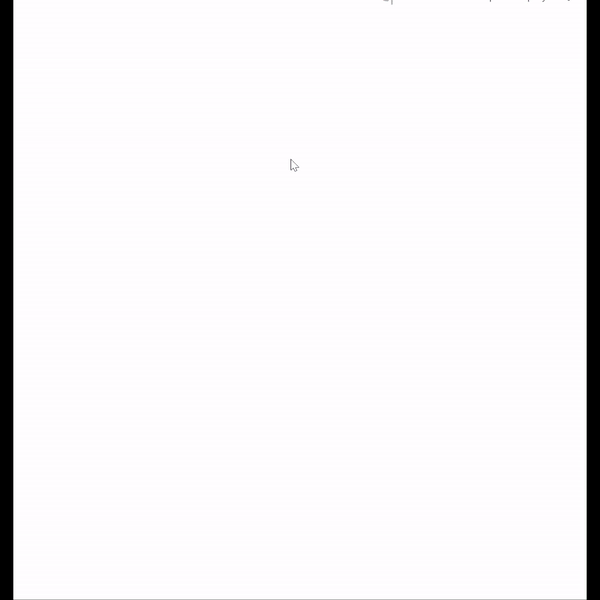

# FinBot: Financial Query Chatbot

FinBot is a next-gen chatbot designed to streamline financial data access by leveraging technologies like **LangChain**, **LLMs (Large Language Models)**, **RAG (Retrieval-Augmented Generation)**, and **Postgres**. FinBot simplifies the process of querying financial data by translating natural language questions into SQL queries, making it highly effective for internal company use.

## Features
- Instant response to financial data-related queries in natural language.
- Uses **Postgres** for efficient data storage and retrieval.
- Integrates **LangChain** to handle complex language models and augment responses with relevant data.
- **LLM + RAG** ensures accurate and meaningful answers.

## Step-by-Step Process:

### 1. User Query:
- The user asks a question in natural language (e.g., "What is the total profit for 2021?").

### 2. LLM & RAG with LangChain:
- The query is processed using **LLMs (Large Language Models)** via **LangChain**.
- **RAG (Retrieval-Augmented Generation)** is employed to enhance accuracy, ensuring responses are based on both internal and external data sources.

### 3. SQL Query Generation:
- The natural language query is converted into an SQL query that interacts with the financial data stored in **Postgres**.

### 4. Data Retrieval from Postgres:
- The SQL query is executed, and relevant data is fetched from the **Postgres** database.

### 5. Natural Language Response:
- The retrieved data is transformed back into an easy-to-read natural language response for the user.

---

## Tech Stack:
- **LangChain**: The framework used to manage the connection between the LLM and the financial database.
- **OpenAI GPT Models**: Handles query understanding and transformation from natural language into SQL.
- **Postgres**: A relational database system where the company's financial data is stored.
- **LLM (Large Language Models)**: Used for interpreting user queries and generating SQL queries.
- **RAG (Retrieval-Augmented Generation)**: Enhances the LLM by fetching additional relevant data from internal or external sources.

---

## Demo
Check out the live demo of FinBot in action!

---

## Applications:
FinBot is specifically tailored for internal use by company employees, helping them access critical financial data quickly without needing SQL knowledge. This enhances decision-making and reduces dependency on database administrators.

---

## Future Scope:
- Expanding to support more complex financial reports.
- Adding more data sources for **RAG** to further enrich responses.
- Implementing advanced data visualization techniques for better financial insights.

---

## Contact & Contribution:
Looking to collaborate or have suggestions? Feel free to reach out or contribute to this project.
